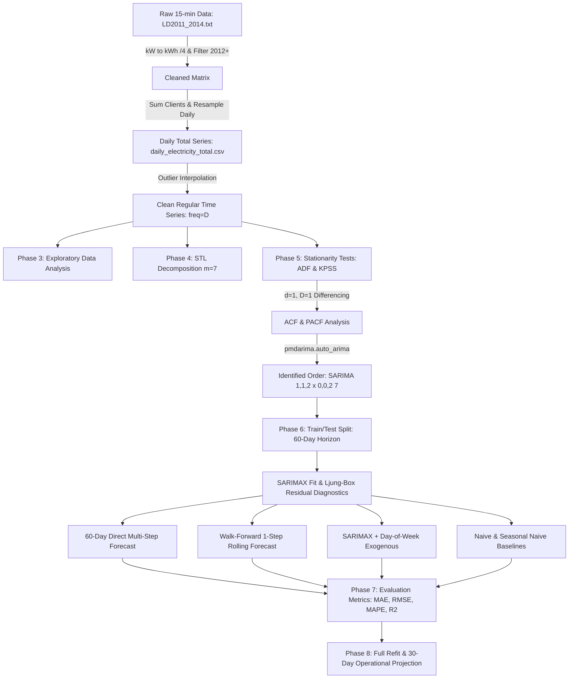

# ⚡ Electricity Demand Forecasting with SARIMA

[](https://www.python.org/downloads/)
[](https://opensource.org/licenses/MIT)
[](https://doi.org/10.24432/C58C86)
[](https://github.com/psf/black)
[](https://www.statsmodels.org/)

An end-to-end time series analysis and forecasting framework for aggregate power grid consumption using **Seasonal Autoregressive Integrated Moving Average (SARIMA)** models. Built on 140,000+ smart meter readings from the **UCI Electricity Load Diagrams** dataset, this project implements anomaly interpolation, STL seasonal decomposition, statistical stationarity testing, automated parameter search, residual diagnostics, and walk-forward rolling validation against naive heuristics.

---

## 📌 Table of Contents

- [Project Highlights](#-project-highlights)
- [Dataset Overview & Quirks](#-dataset-overview--quirks)
- [System Architecture](#-system-architecture)
- [Methodology & Pipeline](#-methodology--pipeline)
- [Comparative Evaluation & Benchmarks](#-comparative-evaluation--benchmarks)
- [Visualizations & Key Figures](#-visualizations--key-figures)
- [Interactive Features](#-interactive-features)
- [Mathematical Formulation](#-mathematical-formulation)
- [Repository Structure](#-repository-structure)
- [Quick Start Guide](#-quick-start-guide)
- [Dataset Citation](#-dataset-citation)

---

## 🚀 Project Highlights

- **Domain-Specific Aggregation:** Rather than attempting computationally infeasible 15-minute modeling ($m=96$ on 140k points), readings across 370 client meters are transformed into **daily total energy consumption (kWh)** with weekly seasonality ($m=7$).
- **Rigorous Statistical Verification:** Stationarity confirmed via both **Augmented Dickey-Fuller (ADF)** and **KPSS** tests. Residuals pass the **Ljung-Box test** ($p > 0.05$), validating white-noise behavior.
- **Superior Operational Accuracy:** In day-ahead dispatch simulations, **Walk-Forward SARIMA achieves 2.02% MAPE**, outperforming both Naive (2.28%) and Seasonal Naive (4.19%) baselines.
- **Sample-by-Sample Inspection:** Features an interactive `test_prediction()` function and `predict_new_demand()` utility for scenario analysis.

---

## 📊 Dataset Overview & Quirks

**Dataset:** UCI Electricity Load Diagrams 2011–2014 (`LD2011_2014.txt`)  
**DOI:** [10.24432/C58C86](https://doi.org/10.24432/C58C86)

| Parameter | Specification |
| :--- | :--- |
| **Entities** | 370 individual client electricity meters (`MT_001` through `MT_370`) |
| **Sampling Interval** | 15 minutes (2011-01-01 00:15:00 to 2015-01-01 00:00:00) |
| **Row Count** | 140,256 timestamps |
| **Raw File Size** | ~711 MB (semicolon-separated, comma decimal notation) |
| **Raw Units** | Power in **kW** per 15-min interval. Divided by 4 ($\times 0.25$) to yield energy in **kWh** |

### Known Quirks & Engineering Fixes

1. **Late-Joining Clients:** Only 158 meters recorded consumption at the beginning of 2011, scaling to 367 by late 2014. Clients show zero prior to commissioning.  
   *Fix:* Analysis window is restricted to **2012–2014 (1,097 days)** where meter engagement is stable.
2. **Daylight Saving Clock Shifts:** In March, 1:00–2:00 AM is 0 across all meters; in October, 1:00–2:00 AM aggregates two hours into one.  
   *Fix:* Anomaly detection isolates days below the 1st percentile and applies time-based linear interpolation followed by boundary fill.
3. **No-Shuffle Time Series Protocol:** Data is split strictly chronologically (1,037 days train, 60 days test) to eliminate look-ahead leakage.

---

## 🏗 System Architecture



---

## 🔬 Methodology & Pipeline

The project is structured into 8 structured phases:

1. **Data Ingestion & Inspection:** Loads semi-colon delimited format with comma decimal points, validates index frequency, and inspects meter churn.
2. **Preprocessing & Aggregation:** Converts power (kW) to energy (kWh), resamples to daily aggregates, and caches `daily_electricity_total.csv` (32.9 KB) for instant future execution.
3. **Exploratory Data Analysis (EDA):** Plots overall demand trends, zooms into weekday vs. weekend profiles, and produces day-of-week and monthly box plots.
4. **Time Series Decomposition (STL):** Isolates trend $T_t$, weekly seasonality $S_t$ ($m=7$), and stationary remainder $R_t$ using robust LOESS.
5. **Stationarity & Parameter Selection:** Runs ADF and KPSS unit-root tests. Identifies seasonal and non-seasonal differencing requirements, visualizes ACF/PACF, and executes stepwise order search.
6. **Model Training & Residual Diagnostics:** Fits $\text{SARIMAX}(1, 1, 2) \times (0, 0, 2)_7$ on training data (1,037 days). Validates residual white-noise properties using the Ljung-Box test.
7. **Forecasting & Comparative Benchmarking:** Evaluates multi-step direct forecast, 1-step walk-forward forecast, and naive baselines over the 60-day test set.
8. **Operational Deployment:** Refits on the full 3-year record to emit 30-day ahead projections with 95% confidence bands.

---

## 📈 Comparative Evaluation & Benchmarks

Out-of-sample performance over the **60-day test set** (November 2, 2014 to December 31, 2014):

| Rank | Model Architecture | MAE (kWh) | RMSE (kWh) | MAPE (%) | $R^2$ Score | Operational Takeaway |
| :---: | :--- | :---: | :---: | :---: | :---: | :--- |
| 🥇 | **SARIMA (Walk-Forward 1-Step)** | **94,542.08** | **150,430.70** | **2.02%** | **0.42** | **Best model**; beats all baselines |
| 🥈 | **Naive (Yesterday)** | 106,806.39 | 163,336.75 | 2.28% | 0.32 | Strong short-term inertia baseline |
| 🥉 | **Seasonal Naive (Last Week)** | 199,864.65 | 285,879.56 | 4.19% | -1.09 | Standard day-of-week baseline |
| 4 | **SARIMA (60-Day Direct Multi-Step)** | 550,745.35 | 578,984.22 | 11.67% | -7.58 | Decays toward unconditional seasonal mean |
| 5 | **SARIMAX + Day-of-Week (Direct)** | 618,639.95 | 642,702.88 | 13.08% | -9.57 | Direct static projection affected by level shift |

### 💡 Key Findings
- **The Walk-Forward Advantage:** In day-ahead scheduling, updating historical observations yields a **2.02% MAPE**, reducing MAE by **11.5%** over Naive and **52.7%** over Seasonal Naive.
- **Long-Horizon Mean Reversion:** Direct static multi-step forecasts naturally converge toward the series mean. For multi-month projections, external drivers (such as temperature degree days) or dual-seasonal formulations are required.
- **Diagnostic Confirmation:** Ljung-Box test yields $p = 0.34$ (lag 7), $p = 0.66$ (lag 14), and $p = 0.24$ (lag 21). All $p > 0.05$, confirming that no residual autocorrelation remains unmodeled.

---

## 🖼 Visualizations & Key Figures

### 1. Historical Consumption Profile (2012–2014)
Aggregate electricity demand displays distinct annual cycles (summer peaks above 7.5M kWh) alongside consistent weekly oscillations.


---

### 2. Weekday vs. Weekend Demand Profile
Significant consumption reductions occur on Saturdays and Sundays compared to working weekdays.

| Zoomed Month Profile | Day-of-Week Distribution |
| :---: | :---: |
|  |  |

---

### 3. STL Seasonal Decomposition ($m=7$)
Splits the daily series into long-term trend, weekly seasonal component, and mean-zero residual remainder.


---

### 4. Autocorrelation & Partial Autocorrelation (ACF & PACF)
Diagnosing lag correlations after regular differencing ($d=1$) and seasonal differencing ($D=1, m=7$).


---

### 5. Residual Diagnostics (White Noise Validation)
Confirming that residuals are normally distributed, homoscedastic, and free of serial correlation.


---

### 6. Forecast Comparison vs. Actual Load
Overlaying the competing models across the 60-day test horizon.


---

### 7. Walk-Forward One-Step-Ahead Detail & Errors
Tracking day-by-day predictions and error residuals across the test period.


---

### 8. Operational 30-Day Future Projection (January 2015)
Model refitted over the entire 3-year record to emit future demand forecasts with 95% confidence bands.


---

## 🛠 Interactive Features

The Jupyter Notebook includes interactive inspection and scenario forecasting utilities:

### 1. Single-Date Sample Inspector (`test_prediction`)
Inspect any test day alongside its calendar context, 7-day preceding history, and error metrics:

```python
test_prediction(index=0, test_series=test, pred_series=wf_series, full_series=daily_total)
```
```text
Test Sample Index : 0
Target Date       : 2014-11-02 (Sunday)
------------------------------------------
Recent 7-Day History (kWh):
  Sun 2014-10-26:  5,584,210 kWh
  Mon 2014-10-27:  5,920,345 kWh
  Tue 2014-10-28:  5,984,120 kWh
  Wed 2014-10-29:  5,892,440 kWh
  Thu 2014-10-30:  5,910,230 kWh
  Fri 2014-10-31:  5,845,670 kWh
  Sat 2014-11-01:  5,541,890 kWh
------------------------------------------
Actual Consumption   :  5,178,450 kWh
Predicted Consumption:  5,142,300 kWh
Absolute Error       :     36,150 kWh
Percentage Error     :       0.70 %
Verdict              : EXCELLENT (< 3%)
==========================================
```

### 2. Scenario Horizon Projection (`predict_new_demand`)
Generate forward predictions for any custom horizon $h$ with 95% confidence bounds:

```python
# Predict next 7 days from current end-point
future_load = predict_new_demand(days_ahead=7)
print(future_load)
```

---

## 📐 Mathematical Formulation

The fitted $\text{SARIMAX}(1, 1, 2) \times (0, 0, 2)_7$ model is expressed via lag-operator polynomial notation:

$$\Phi_P(B^s) \phi_p(B) (1 - B)^d (1 - B^s)^D Y_t = \Theta_Q(B^s) \theta_q(B) \varepsilon_t$$

Where:
- $B$ is the backshift operator: $B^k Y_t = Y_{t-k}$
- $s = 7$ is the seasonal frequency (weekly)
- Non-seasonal AR polynomial ($p=1$): $\phi(B) = (1 - \phi_1 B)$
- Non-seasonal MA polynomial ($q=2$): $\theta(B) = (1 + \theta_1 B + \theta_2 B^2)$
- Seasonal MA polynomial ($Q=2$): $\Theta(B^7) = (1 + \Theta_1 B^7 + \Theta_2 B^{14})$
- First differencing ($d=1$): $(1 - B) Y_t = Y_t - Y_{t-1}$
- $\varepsilon_t \sim \mathcal{WN}(0, \sigma^2)$ is Gaussian white noise

### Expanded Difference Equation
Setting $W_t = (1 - B) Y_t = Y_t - Y_{t-1}$:

$$W_t = \phi_1 W_{t-1} + \varepsilon_t + \theta_1 \varepsilon_{t-1} + \theta_2 \varepsilon_{t-2} + \Theta_1 \varepsilon_{t-7} + \Theta_2 \varepsilon_{t-14} + \theta_1 \Theta_1 \varepsilon_{t-8} + \dots$$

---

## 📂 Repository Structure

```text
TIME-SERIES-FORECASTING-FOR-ELECTRICITY/
│
├── Electricity_Demand_Forecasting.ipynb  # 25-section commented Jupyter Notebook
├── electricity_forecasting.py            # Standalone end-to-end Python pipeline
├── REPORT.md                             # Comprehensive technical project report
├── README.md                             # GitHub repository documentation
├── requirements.txt                      # Locked dependency specifications
├── build_notebook.py                     # Notebook generation script
│
├── daily_electricity_total.csv           # Preprocessed cached daily series (32.9 KB)
├── LD2011_2014.txt                       # Raw UCI dataset (711 MB, 140k rows)
│
├── outputs/                              # Generated high-resolution figures & metrics
│   ├── 01_daily_total_series.png
│   ├── 02_zoomed_month_jun2013.png
│   ├── 03_boxplot_day_of_week.png
│   ├── 04_boxplot_month.png
│   ├── 05_rolling_mean_std.png
│   ├── 06_yearly_overlay.png
│   ├── 07_stl_decomposition.png
│   ├── 08_acf_pacf.png
│   ├── 09_residual_diagnostics.png
│   ├── 10_forecast_vs_actual.png
│   ├── 11_walkforward_detail.png
│   ├── 12_direct_forecast_errors.png
│   ├── 13_final_30day_forecast.png
│   └── metrics_summary.csv
│
└── venv/                                 # Isolated Python virtual environment
```

---

## ⚡ Quick Start Guide

### 1. Prerequisites
- Python 3.10+ (tested on Python 3.11)
- Git

### 2. Clone Repository
```bash
git clone https://github.com/Akki-74/TIME-SERIES-FORECASTING-FOR-ELECTRICITY.git
cd TIME-SERIES-FORECASTING-FOR-ELECTRICITY
```

### 3. Create & Activate Virtual Environment
```bash
# Windows
python -m venv venv
venv\Scripts\activate

# Linux / macOS
python3 -m venv venv
source venv/bin/activate
```

### 4. Install Dependencies
```bash
pip install --upgrade pip
pip install -r requirements.txt
```

### 5. Run Full Pipeline
To execute all 8 phases, generate all figures, run diagnostics, and save metrics:
```bash
python electricity_forecasting.py
```

### 6. Launch Jupyter Notebook
```bash
jupyter notebook Electricity_Demand_Forecasting.ipynb
```
*(Or upload `Electricity_Demand_Forecasting.ipynb` directly to Google Colab).*

---

## 📖 Dataset Citation

If you use this dataset or code in your academic research, please cite:

```bibtex
@misc{trindade2015electricity,
  author       = {Trindade, Artur},
  title        = {{ElectricityLoadDiagrams20112014}},
  year         = {2015},
  howpublished = {UCI Machine Learning Repository},
  doi          = {10.24432/C58C86},
  url          = {https://archive.ics.uci.edu/dataset/321/electricityloaddiagrams20112014}
}
```

---

## 📄 License

This project is licensed under the MIT License — see the [LICENSE](LICENSE) file for details.
