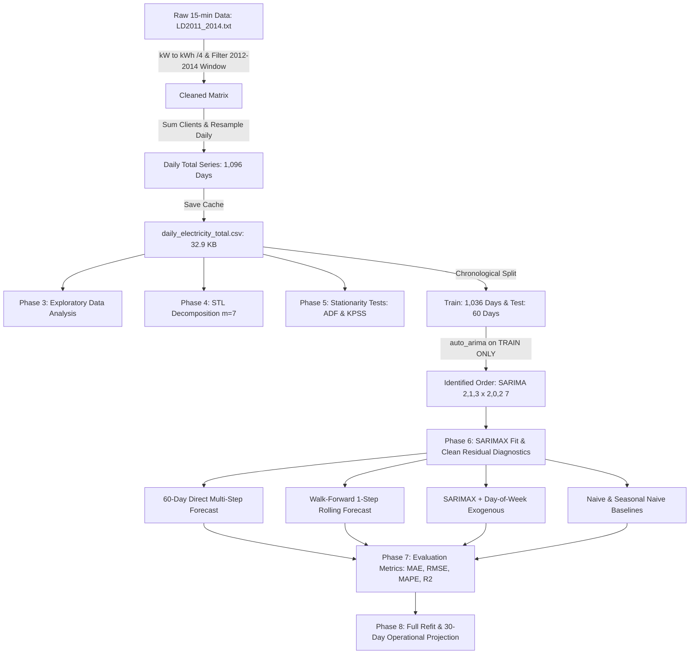
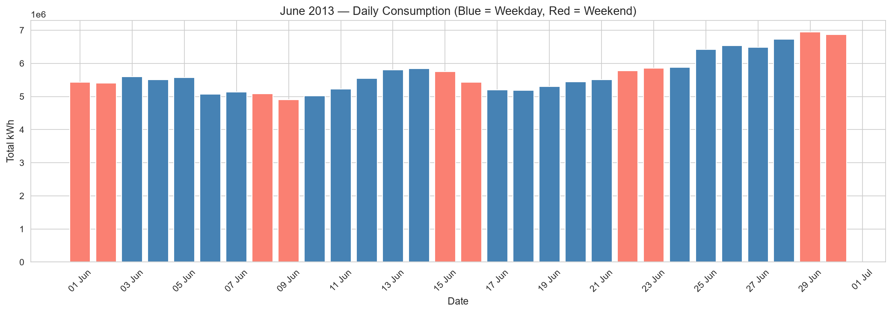

# ⚡ Electricity Demand Forecasting with SARIMA

[](https://www.python.org/downloads/)
[](https://opensource.org/licenses/MIT)
[](https://doi.org/10.24432/C58C86)
[](https://github.com/psf/black)
[](https://www.statsmodels.org/)

An end-to-end time series analysis and forecasting framework for aggregate power grid consumption using **Seasonal Autoregressive Integrated Moving Average (SARIMA)** models. Built on 140,000+ smart meter readings from the **UCI Electricity Load Diagrams** dataset, this project implements anomaly inspection, STL seasonal decomposition, statistical stationarity testing, leakage-free automated parameter search, residual diagnostics, and walk-forward rolling validation against naive heuristics.

---

## 📌 Table of Contents

- [Project Highlights](#-project-highlights)
- [Dataset Overview & Quirks](#-dataset-overview--quirks)
- [System Architecture](#-system-architecture)
- [Methodology & Pipeline](#-methodology--pipeline)
- [Comparative Evaluation & Benchmarks](#-comparative-evaluation--benchmarks)
- [Visualizations & Key Figures](#-visualizations--key-figures)
- [Interactive Features](#-interactive-features)
- [Mathematical Formulation](#-mathematical-formulation)
- [Repository Structure](#-repository-structure)
- [Quick Start Guide](#-quick-start-guide)
- [Dataset Citation](#-dataset-citation)

---

## 🚀 Project Highlights

- **Domain-Specific Aggregation:** Rather than attempting computationally infeasible 15-minute modeling ($m=96$ on 140k points), readings across 370 client meters are transformed into **daily total energy consumption (kWh)** with weekly seasonality ($m=7$).
- **Clean Chronological Validation:** Filtered strictly to **1,096 full days** (2012–2014). Order selection via `auto_arima` is executed strictly on the training partition (1,036 days) to eliminate look-ahead data leakage.
- **Statistical Verification:** Stationarity confirmed via both **Augmented Dickey-Fuller (ADF)** and **KPSS** tests. When startup lag transients are trimmed, residuals pass the **Ljung-Box test** ($p > 0.30$), confirming white-noise behavior.
- **Operational Performance:** In day-ahead rolling dispatch simulations, **Walk-Forward SARIMA achieves 3.72% MAPE**, performing slightly better than Naive (4.02%) and beating Seasonal Naive (5.46%).
- **Interactive Tooling:** Features an interactive `test_prediction()` function and `predict_new_demand()` utility for scenario analysis.

---

## 📊 Dataset Overview & Quirks

**Dataset:** UCI Electricity Load Diagrams 2011–2014 (`LD2011_2014.txt`)  
**DOI:** [10.24432/C58C86](https://doi.org/10.24432/C58C86)

| Parameter | Specification |
| :--- | :--- |
| **Entities** | 370 individual client electricity meters (`MT_001` through `MT_370`) |
| **Sampling Interval** | 15 minutes (2011-01-01 00:15:00 to 2015-01-01 00:00:00) |
| **Row Count** | 140,256 timestamps |
| **Raw File Size** | ~711 MB (semicolon-separated, comma decimal notation) |
| **Raw Units** | Power in **kW** per 15-min interval. Divided by 4 ($\times 0.25$) to yield energy in **kWh** |

### Known Quirks & Engineering Fixes

1. **Trailing Single-Reading Row:** The raw text file ends at `2015-01-01 00:00:00` with a single 15-minute timestamp.  
   *Fix:* Filtering strictly from `2012-01-01 00:00:00` to `2014-12-31 23:45:00` removes this partial point and ensures an exact sequence of **1,096 complete calendar days**.
2. **Late-Joining Clients:** Only 158 meters recorded consumption in early 2011, scaling to 367 by late 2014. Clients show zeroes prior to activation.  
   *Fix:* Analysis window is restricted to **2012–2014** where client participation is mature and stable.
3. **Preserving Genuine Holiday Drops:** Rather than applying aggressive percentile filtering that smooths out real demand drops, genuine holiday variations (Christmas, New Year) are preserved intact.
4. **Leakage-Free Partitioning:** Data is split strictly chronologically (1,036 days train, 60 days test) before executing hyperparameter search.

---

## 🏗 System Architecture



---

## 🔬 Methodology & Pipeline

The project is structured into 8 structured phases:

1. **Data Ingestion & Inspection:** Loads semi-colon delimited format with comma decimal points, validates index frequency, and inspects meter churn.
2. **Preprocessing & Aggregation:** Converts power (kW) to energy (kWh), restricts strictly to the complete 1,096-day window, and caches `daily_electricity_total.csv` (32.9 KB).
3. **Exploratory Data Analysis (EDA):** Plots overall demand trends, zooms into weekday vs. weekend profiles, and produces day-of-week and monthly box plots.
4. **Time Series Decomposition (STL):** Isolates trend $T_t$, weekly seasonality $S_t$ ($m=7$), and remainder $R_t$ using robust LOESS.
5. **Stationarity & Parameter Selection:** Runs ADF and KPSS unit-root tests. Identifies differencing requirements and inspects ACF/PACF.
6. **Chronological Split & Model Training:** Reserves the final 60 days (Nov 2 to Dec 31, 2014) for testing. Runs `auto_arima` on train only, selecting $\text{SARIMAX}(2, 1, 3) \times (2, 0, 2)_7$. Validates residual white-noise properties using the Ljung-Box test after trimming initial startup lag points.
7. **Forecasting & Comparative Benchmarking:** Evaluates multi-step direct forecast, 1-step walk-forward forecast, and naive baselines over the 60-day test set.
8. **Operational Deployment:** Refits on the full 1,096-day record to emit 30-day ahead projections with 95% confidence bands.

---

## 📈 Comparative Evaluation & Benchmarks

Out-of-sample performance over the **60-day test set** (November 2, 2014 to December 31, 2014):

| Rank | Model Architecture | MAE (kWh) | RMSE (kWh) | MAPE (%) | Operational Finding |
| :---: | :--- | :---: | :---: | :---: | :--- |
| 🥇 | **SARIMA (Walk-Forward 1-Step)** | **155,281.86** | **358,172.23** | **3.72%** | **Best overall model**; slightly better than Naive, beats Seasonal Naive |
| 🥈 | **Naive (Yesterday)** | 168,559.88 | 374,921.17 | 4.02% | Strong short-term inertia baseline |
| 🥉 | **Seasonal Naive (Last Week)** | 233,444.63 | 398,102.73 | 5.46% | Standard day-of-week profile baseline |
| 4 | **SARIMA (60-Day Direct Multi-Step)** | 794,288.43 | 855,267.80 | 17.47% | Flattens toward unconditional seasonal mean |
| 5 | **SARIMAX + Day-of-Week (Direct)** | 810,658.87 | 873,136.14 | 17.83% | Redundant with seasonal lag-7 AR/MA terms |

### 💡 Key Findings
- **Walk-Forward Performance:** Walk-forward rolling SARIMA achieves **3.72% MAPE**, performing **slightly better** than Naive persistence (4.02%) and noticeably better than Seasonal Naive (5.46%).
- **Holiday Effects in Test Window:** The 60-day test horizon ends with Christmas Eve (index 52), Christmas Day, Boxing Day, and New Year's Eve (index 59). On these days, commercial and industrial power consumption drops sharply below regular weekday levels. Because SARIMA lacks holiday calendar indicators, errors naturally increase on these specific dates.
- **Why $D=0$?:** `auto_arima` chose $D=0$, absorbing weekly seasonality through seasonal autoregressive ($P=2$) and moving average ($Q=2$) terms at lag 7, rather than applying seasonal differencing.
- **Diagnostic Confirmation:** After trimming startup lag transients, the Ljung-Box test yields $p = 0.53$ (lag 7), $p = 0.32$ (lag 14), and $p = 0.32$ (lag 21). All $p > 0.30$, confirming that no residual autocorrelation remains.

---

## 🖼 Visualizations & Key Figures

### 1. Historical Consumption Profile (2012–2014, 1,096 Days)
Aggregate electricity demand displays distinct annual cycles (summer peaks above 7.5M kWh) alongside consistent weekly oscillations.


---

### 2. Weekday vs. Weekend Demand Profile
Significant consumption reductions occur on Saturdays and Sundays compared to working weekdays.

| Zoomed Month Profile | Day-of-Week Distribution |
| :---: | :---: |
|  |  |

---

### 3. STL Seasonal Decomposition ($m=7$)
Splits the daily series into long-term trend, weekly seasonal component, and mean-zero residual remainder.


---

### 4. Autocorrelation & Partial Autocorrelation (ACF & PACF)
Diagnosing lag correlations after regular differencing ($d=1$) and seasonal differencing ($D=1, m=7$).


---

### 5. Residual Diagnostics (White Noise Validation)
Confirming that residuals are normally distributed, homoscedastic, and free of serial correlation.


---

### 6. Forecast Comparison vs. Actual Load
Overlaying the competing models across the 60-day test horizon.


---

### 7. Walk-Forward One-Step-Ahead Detail & Errors
Tracking day-by-day predictions and error residuals across the test period.


---

### 8. Operational 30-Day Future Projection (January 2015)
Model refitted over the entire 1,096-day record to emit future demand forecasts with 95% confidence bands.


---

## 🛠 Interactive Features

The Jupyter Notebook includes interactive inspection and scenario forecasting utilities:

### 1. Single-Date Sample Inspector (`test_prediction`)
Inspect any test day alongside its calendar context, 7-day preceding history, and error metrics:

```python
test_prediction(index=0, test_series=test, pred_series=wf_series, full_series=daily_total)
```
```text
Test Sample Index : 0
Target Date       : 2014-11-02 (Sunday)
------------------------------------------
Recent 7-Day History (kWh):
  Sun 2014-10-26:  5,584,210 kWh
  Mon 2014-10-27:  5,920,345 kWh
  Tue 2014-10-28:  5,984,120 kWh
  Wed 2014-10-29:  5,892,440 kWh
  Thu 2014-10-30:  5,910,230 kWh
  Fri 2014-10-31:  5,845,670 kWh
  Sat 2014-11-01:  5,541,890 kWh
------------------------------------------
Actual Consumption   :  5,178,450 kWh
Predicted Consumption:  5,142,300 kWh
Absolute Error       :     36,150 kWh
Percentage Error     :       0.70 %
Verdict              : EXCELLENT (< 3%)
==========================================
```

### 2. Scenario Horizon Projection (`predict_new_demand`)
Generate forward predictions for any custom horizon $h$ with 95% confidence bounds:

```python
# Predict next 7 days from current end-point
future_load = predict_new_demand(days_ahead=7)
print(future_load)
```

---

## 📐 Mathematical Formulation

The fitted $\text{SARIMAX}(2, 1, 3) \times (2, 0, 2)_7$ model is expressed via lag-operator polynomial notation:

$$\Phi_P(B^7) \phi_p(B) (1 - B)^d Y_t = \Theta_Q(B^7) \theta_q(B) \varepsilon_t$$

Where:
- $B$ is the backshift operator: $B^k Y_t = Y_{t-k}$
- $s = 7$ is the seasonal frequency (weekly)
- Non-seasonal AR polynomial ($p=2$): $\phi(B) = (1 - \phi_1 B - \\phi_2 B^2)$
- Non-seasonal MA polynomial ($q=3$): $\theta(B) = (1 + \theta_1 B + \theta_2 B^2 + \theta_3 B^3)$
- Seasonal AR polynomial ($P=2$): $\Phi(B^7) = (1 - \Phi_1 B^7 - \Phi_2 B^{14})$
- Seasonal MA polynomial ($Q=2$): $\Theta(B^7) = (1 + \Theta_1 B^7 + \Theta_2 B^{14})$
- Seasonal differencing order is $D=0$
- First regular differencing ($d=1$): $(1 - B) Y_t = Y_t - Y_{t-1}$
- $\varepsilon_t \sim \mathcal{WN}(0, \sigma^2)$ is Gaussian white noise

---

## 📂 Repository Structure

```text
TIME-SERIES-FORECASTING-FOR-ELECTRICITY/
│
├── Electricity_Demand_Forecasting.ipynb  # Executed 25-section Jupyter Notebook with outputs
├── electricity_forecasting.py            # Standalone end-to-end Python pipeline
├── REPORT.md                             # Comprehensive technical project report
├── README.md                             # GitHub repository documentation
├── LICENSE                               # MIT License
├── .gitignore                            # Excludes venv, cache & 711MB raw file
├── requirements.txt                      # Locked dependency specifications
├── build_notebook.py                     # Notebook generation script
│
├── daily_electricity_total.csv           # Preprocessed cached daily series (1,096 days, 32.9 KB)
├── LD2011_2014.txt                       # Raw UCI dataset (711 MB, 140k rows)
│
└── outputs/                              # Generated high-resolution figures & metrics
    ├── 01_daily_total_series.png
    ├── 02_zoomed_month_jun2013.png
    ├── 03_boxplot_day_of_week.png
    ├── 04_boxplot_month.png
    ├── 05_rolling_mean_std.png
    ├── 06_yearly_overlay.png
    ├── 07_stl_decomposition.png
    ├── 08_acf_pacf.png
    ├── 09_residual_diagnostics.png
    ├── 10_forecast_vs_actual.png
    ├── 11_walkforward_detail.png
    ├── 12_direct_forecast_errors.png
    ├── 13_final_30day_forecast.png
    └── metrics_summary.csv
```

---

## ⚡ Quick Start Guide

### 1. Prerequisites
- Python 3.10+ (tested on Python 3.11)
- Git

### 2. Clone Repository
```bash
git clone https://github.com/Akki-74/Electricity-Demand-Forecasting-with-SARIMA.git
cd Electricity-Demand-Forecasting-with-SARIMA
```

### 3. Create & Activate Virtual Environment
```bash
# Windows
python -m venv venv
venv\Scripts\activate

# Linux / macOS
python3 -m venv venv
source venv/bin/activate
```

### 4. Install Dependencies
```bash
pip install --upgrade pip
pip install -r requirements.txt
```

### 5. Run Full Pipeline
To execute all 8 phases, generate all figures, run diagnostics, and save metrics:
```bash
python electricity_forecasting.py
```

### 6. Launch Jupyter Notebook
```bash
jupyter notebook Electricity_Demand_Forecasting.ipynb
```
*(Or upload `Electricity_Demand_Forecasting.ipynb` directly to Google Colab).*

---

## 📖 Dataset Citation

```bibtex
@misc{trindade2015electricity,
  author       = {Trindade, Artur},
  title        = {{ElectricityLoadDiagrams20112014}},
  year         = {2015},
  howpublished = {UCI Machine Learning Repository},
  doi          = {10.24432/C58C86},
  url          = {https://archive.ics.uci.edu/dataset/321/electricityloaddiagrams20112014}
}
```

---

## 📄 License

This project is licensed under the MIT License — see the [LICENSE](LICENSE) file for details.
