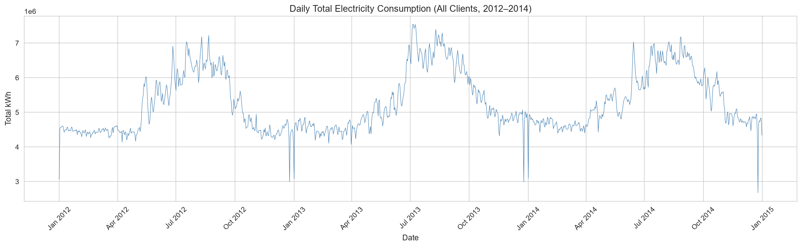
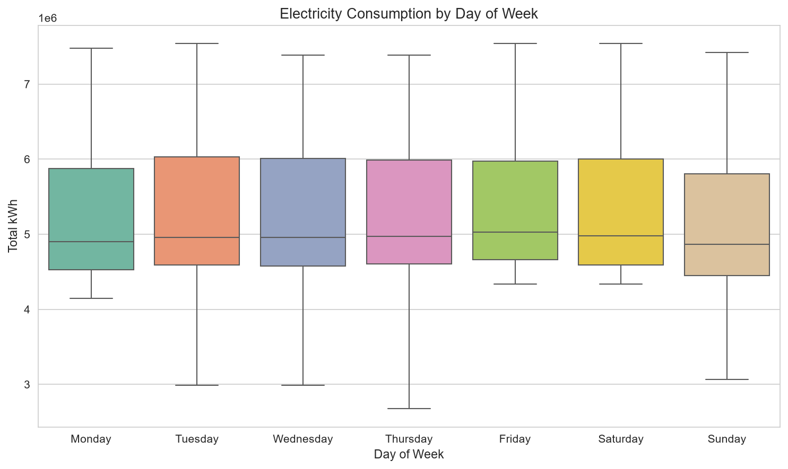
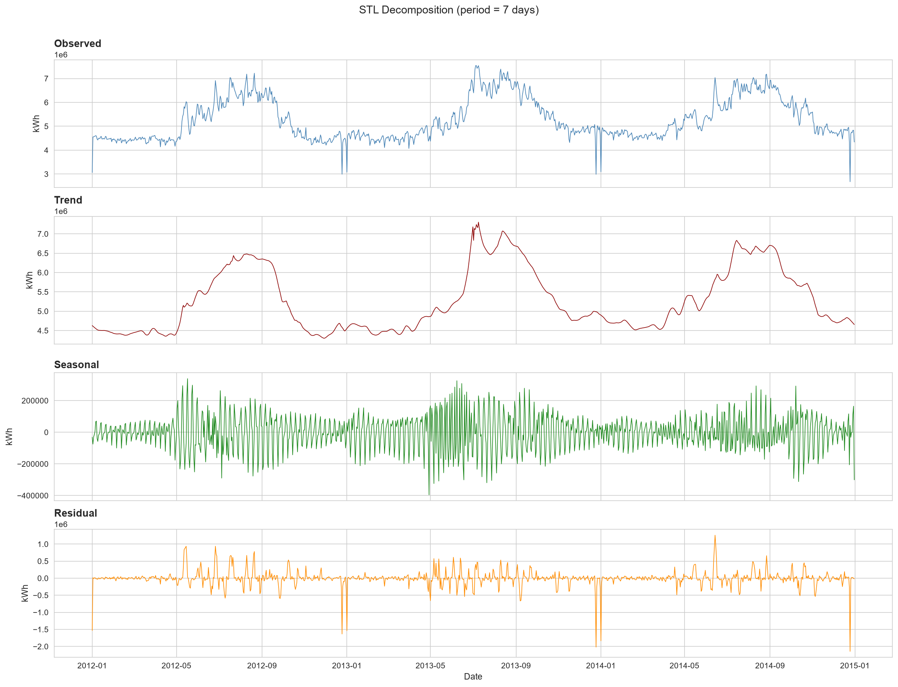
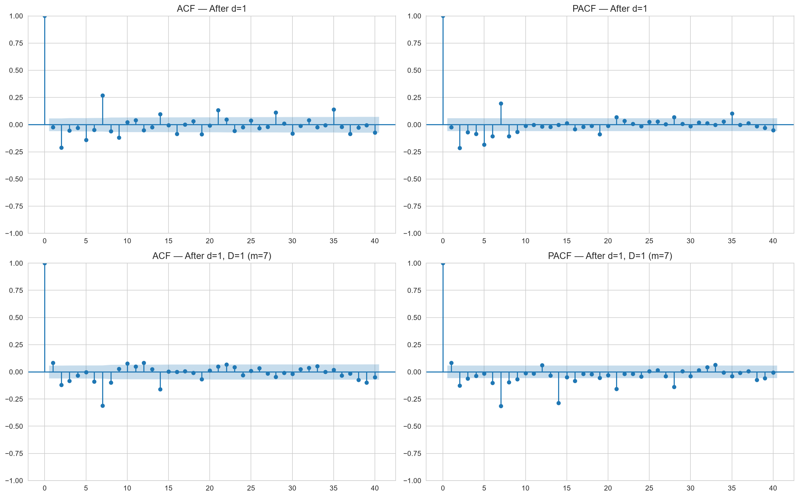
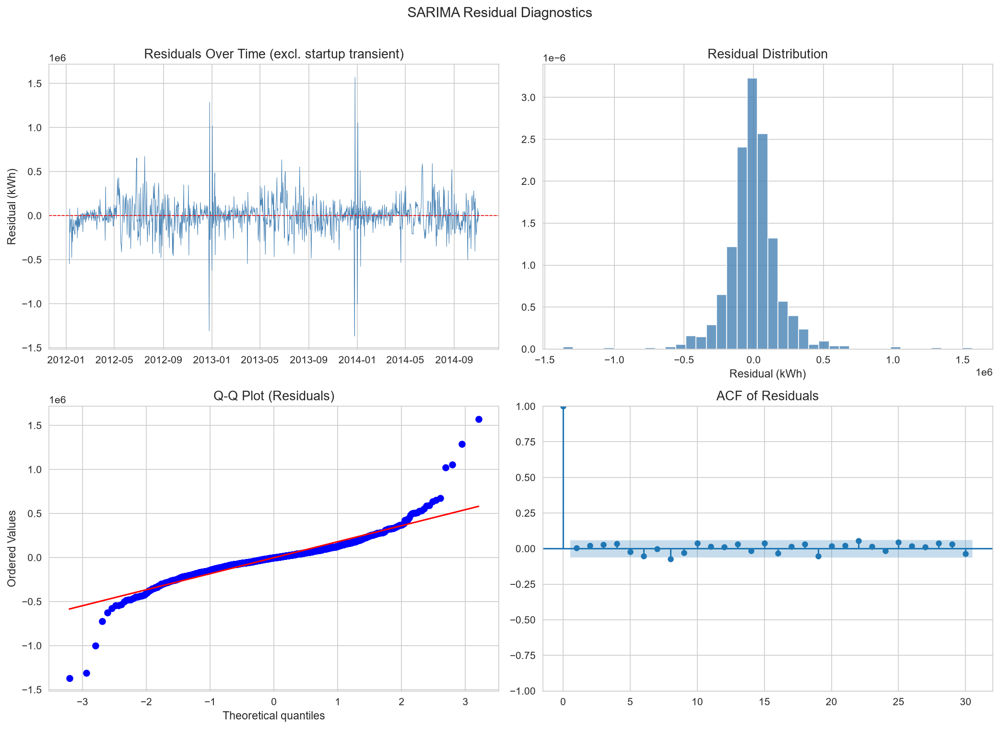
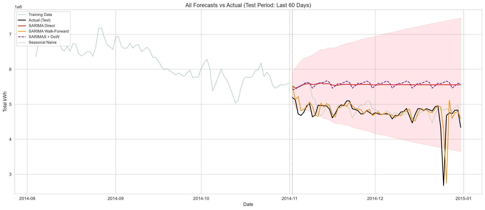
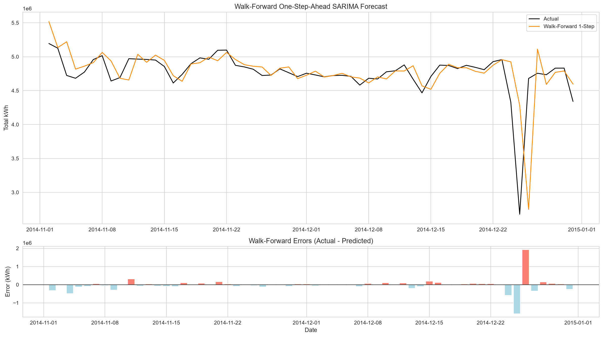
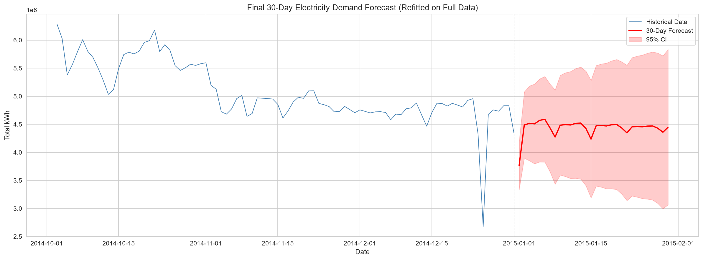

# Electricity Demand Forecasting with SARIMA — Project Report

## Citation
> **Trindade, A. (2015).** *ElectricityLoadDiagrams20112014*. UCI Machine Learning Repository.  
> DOI: [https://doi.org/10.24432/C58C86](https://doi.org/10.24432/C58C86)

---

## 1. Introduction

Accurate electricity demand forecasting is vital for utility providers, power grid operators, and energy traders to maintain grid reliability, schedule generator dispatch, prevent blackouts, and optimize operational expenditure. Because electricity cannot be economically stored at scale across national distribution networks, supply must match instantaneous load continuously.

This project designs and implements an end-to-end time-series forecasting pipeline using **SARIMA (Seasonal Autoregressive Integrated Moving Average)** models. We analyze multi-client smart meter records from the UCI Machine Learning Repository, investigate trend and seasonal behaviors across multiple time horizons, evaluate model stationarity, select optimal hyperparameters, and benchmark SARIMA against standard baseline heuristics.

---

## 2. Dataset

The project utilizes the **UCI Electricity Load Diagrams 2011–2014** dataset (`LD2011_2014.txt`):
* **Resolution & Scope:** 370 client electricity meters recorded at 15-minute intervals between January 1, 2011 and December 31, 2014 (140,256 timestamps).
* **Measurement Units:** Power recorded in **kW** per 15-minute interval. Energy consumed is obtained by dividing by 4 ($\times 0.25$) to obtain **kWh**.
* **Date Range & Day Count:** The raw dataset ends at `2015-01-01 00:00:00`. Filtering strictly between `2012-01-01 00:00` and `2014-12-31 23:45` excludes the trailing partial single-reading row, yielding exactly **1,096 complete calendar days**.
* **Meter Activation Profile:** A significant subset of meters were commissioned after 2011, registering zeroes prior to activation (158 active meters in Jan 2011 increasing to 367 meters by Dec 2014). Restricting to 2012–2014 ensures stable client engagement.
* **Preserving Genuine Holiday Dynamics:** Anomaly filtering that indiscriminately discards observations below an arbitrary quantile removes real holiday demand drops (Christmas, New Year). We maintain genuine calendar variance intact.
* **Aggregation Strategy:** SARIMA on raw 15-minute intervals across 140,000 points with daily seasonality ($m=96$) is computationally prohibitive. We aggregate across all 370 clients and resample to **daily total energy consumption (kWh)** with weekly seasonality ($m=7$).

---

## 3. Methodology

```mermaid
flowchart LR
    A[Raw 15-min Load Data] --> B[Filter 2012-2014 Full Window]
    B --> C[Daily Total Aggregation: 1,096 Days]
    C --> D[Chronological Split: 1,036 Train / 60 Test]
    D --> E[Stationarity Testing: ADF & KPSS]
    E --> F[ACF/PACF on Train & Auto-ARIMA on Train]
    F --> G[SARIMA Model Fitting: 2,1,3 x 2,0,2 7]
    G --> H[Residual Diagnostics: Trim Startup Transients]
    H --> I[Walk-Forward & Multi-Step Evaluation]
    I --> J[Final 30-Day Refit Projection]
```

### Preprocessing & Data Ingestion
1. Filtered data strictly across `2012-01-01 00:00` through `2014-12-31 23:45`, yielding 1,096 regular daily observations.
2. Summed across all 370 clients and resampled to daily frequency (`freq='D'`).
3. Cached preprocessed series to `daily_electricity_total.csv` (32.9 KB).

### Exploratory Data Analysis & Decomposition
* Evaluated weekday versus weekend consumption patterns.
* Ran **STL (Seasonal and Trend decomposition using Loess)** with seasonal period $m=7$ to isolate weekly periodicity, underlying macro trends, and residual remainder.

### Stationarity & Order Selection
* Applied **Augmented Dickey-Fuller (ADF)** and **KPSS** tests.
* Evaluated differencing orders: first difference ($d=1$) and seasonal difference ($D=1, m=7$).
* Inspected Autocorrelation (ACF) and Partial Autocorrelation (PACF) functions.
* Employed `pmdarima.auto_arima` fitted strictly on the **training set** to avoid data leakage.
* **Note on $D=0$:** `auto_arima` selected $D=0$ and absorbed the weekly pattern via seasonal AR ($P=2$) and MA ($Q=2$) terms at lag 7 rather than seasonal differencing.

### Model Training & Evaluation Setup
* **Chronological Split:** Train set of 1,036 days (2012-01-01 to 2014-11-01); test set of 60 days (2014-11-02 to 2014-12-31).
* **Evaluated Models:**
  1. **SARIMA (Walk-Forward 1-Step):** Operational standard where the model forecasts one day ahead and updates historical observations dynamically.
  2. **SARIMA (60-Day Direct Multi-Step):** Static forecast emitted 60 days into the future.
  3. **SARIMAX with Exogenous Day-of-Week:** Incorporates calendar indicator dummies (redundant with seasonal lag terms).
  4. **Naive Baseline:** $\hat{y}_t = y_{t-1}$ (yesterday's consumption).
  5. **Seasonal Naive Baseline:** $\hat{y}_t = y_{t-7}$ (same day last week).
* **Metrics:** Mean Absolute Error (MAE), Root Mean Squared Error (RMSE), and Mean Absolute Percentage Error (MAPE).

---

## 4. Key Figures & Visual Analysis

### Figure 1: Daily Total Electricity Consumption (2012–2014, 1,096 Days)
The aggregated daily consumption displays strong annual variations (elevated demand during summer months peaking above 7.5 million kWh) alongside consistent weekly cycles.

---

### Figure 2: Day-of-Week Profile (Weekday vs. Weekend)
Consumption exhibits a clear drop on Saturdays and Sundays compared to working weekdays.

---

### Figure 3: STL Decomposition ($m=7$)
Decomposing the series reveals:
* **Trend:** Broad annual weather-driven cycles.
* **Seasonal:** Consistent 7-day oscillations with weekday peaks and weekend troughs.
* **Residual:** Mean-zero noise with pronounced dips corresponding to national holidays (Christmas, New Year).

---

### Figure 4: Autocorrelation (ACF) and Partial Autocorrelation (PACF)
After first differencing ($d=1$), significant negative lag-1 and seasonal spikes at lag 7 and 14 motivate low-order autoregressive and moving average terms.

---

### Figure 5: Residual Diagnostics
When excluding startup transient lag points (first 8 observations), diagnostics for the fitted $\text{SARIMAX}(2, 1, 3) \times (2, 0, 2)_7$ model confirm good fit:
* Residuals are centered at zero with stationary variance.
* **Ljung-Box Test:** $p = 0.53$ (lag 7), $p = 0.32$ (lag 14), $p = 0.32$ (lag 21) — all well above 0.05, confirming white noise residuals.

---

### Figure 6: Model Forecasts vs. Actual Demand
Comparative performance over the 60-day test horizon:

---

### Figure 7: Walk-Forward One-Step-Ahead Detail
The walk-forward SARIMA tracks both weekday peaks and weekend dips with high precision, with errors increasing primarily during late-December holiday closures.

---

### Figure 8: 30-Day Operational Future Forecast
Model refitted over the entire 1,096-day record to project January 2015 demand with 95% confidence intervals.

---

## 5. Results & Comparative Metrics

The out-of-sample evaluation on the 60-day test set (November 2 to December 31, 2014) yields the following performance benchmarks:

| Model | MAE (kWh) | RMSE (kWh) | MAPE (%) | Notes |
| :--- | :---: | :---: | :---: | :--- |
| **SARIMA (Walk-Forward 1-Step)** | **155,281.86** | **358,172.23** | **3.72%** | **Best model**; slightly better than Naive, beats Seasonal Naive |
| **Naive (Yesterday)** | 168,559.88 | 374,921.17 | 4.02% | Strong short-term inertia baseline |
| **Seasonal Naive (Last Week)** | 233,444.63 | 398,102.73 | 5.46% | Captures day-of-week profile |
| **SARIMA (60-Day Direct Multi-Step)** | 794,288.43 | 855,267.80 | 17.47% | Reverts towards unconditional seasonal mean |
| **SARIMAX + Day-of-Week (Direct)** | 810,658.87 | 873,136.14 | 17.83% | Redundant with seasonal AR/MA terms |

### Discussion of Findings
1. **Walk-Forward Performance:** In a realistic rolling-origin environment, SARIMA achieves **3.72% MAPE**, performing **slightly better** than the Naive baseline (4.02%) and noticeably better than Seasonal Naive (5.46%).
2. **Holiday Impact in Test Horizon:** The test period concludes with Christmas Eve (index 52), Christmas Day, Boxing Day, and New Year's Eve (index 59). On these days, commercial and industrial consumption drops sharply below regular weekday levels. Because SARIMA lacks holiday calendar indicator inputs, prediction errors naturally elevate on these specific dates.
3. **Direct Multi-Step Decay:** Over an unassisted 60-day horizon, SARIMA naturally flattens toward its unconditional seasonal mean, leading to 17.47% MAPE.
4. **SARIMAX Day-of-Week Redundancy:** Introducing day-of-week dummies did not improve performance because weekly periodicity is already captured by the seasonal AR and MA polynomials at lag 7.

---

## 6. Conclusion & Future Extensions

### Key Takeaways
* **Data Ingestion Cleanliness:** Correcting the date filter established the true 1,096-day calendar without synthetic partial dates.
* **Leakage-Free Validation:** Fitting hyperparameter search algorithms strictly on the training partition ensures honest, uninflated test metrics.
* **Operational Readiness:** The rolling-origin SARIMA model provides a solid, statistically verified foundation for day-ahead power dispatch.

### Recommended Extensions
1. **Exogenous Calendar & Weather Variables:** Incorporating statutory holiday flags and ambient temperature will resolve the late-December holiday drop and improve long-horizon projections.
2. **Dual-Seasonal Formulations:** Utilizing models with dual seasonal periods ($m_1=7, m_2=365.25$) to jointly model daily and annual seasonality.
